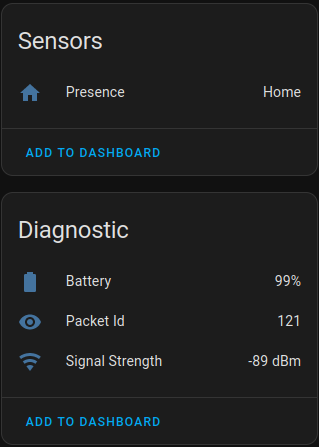
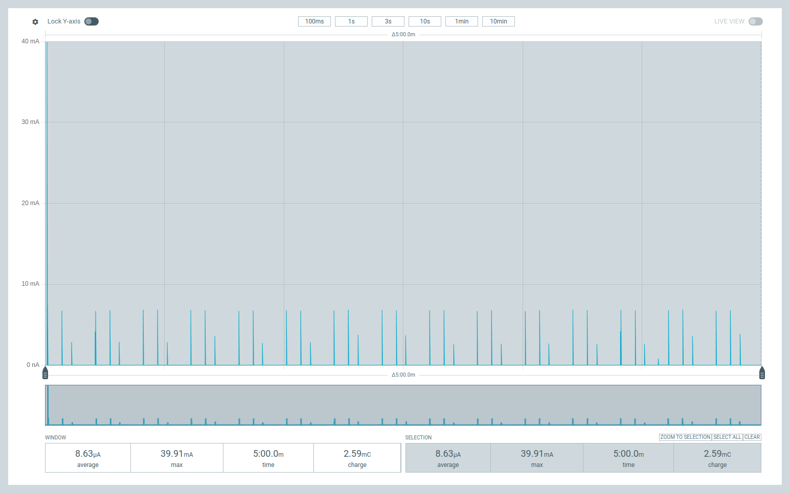

<!-- omit from toc -->
# Firmware

- [Features](#features)
  - [Future work](#future-work)
- [Flashing](#flashing)
- [Power consumption](#power-consumption)
  - [Show your work](#show-your-work)
- [Development](#development)

## Features

Right now, the firmware is very simple.
The main application is in [`ble_advertise_timer.rs`](./src/bin/ble_advertise_timer.rs).

On supported hardware, it will poll the battery voltage and broadcast that information over BLE in BTHome format.

The tag shows up in Home Assistant like so:



### Future work

In no particular order:

- OTA updates.
- Support for additional sensors. Specifically, support for accelerometers
- Configure broadcast interval/power and other settings via BLE. Currently this is all hardcoded.

## Flashing

I am using [`probe-rs`](https://github.com/probe-rs) to flash the firmware but any ARM compatible programmer should work.

For reference, I am using a cheap [J-Link clone](https://www.aliexpress.us/item/3256804586936834.html) which `probe-rs` supports but there are [several other supported probes as well](https://probe.rs/docs/getting-started/probe-setup) that may be better suited for your needs.

Assuming `probe-rs` is installed and working, you can download the 'combined' `zip` from the [releases](https://github.com/kquinsland/bthome-presence/releases) page and then flash the `bin` file:

```shell
# Extract
❯ unzip ble_advertise_timer.combined.zip
Archive:  ble_advertise_timer.combined.zip
  inflating: ble_advertise_timer.combined.bin
  inflating: ble_advertise_timer.combined.bin.sha256  
# Validate
❯ shasum -a 256 -c ble_advertise_timer.combined.bin.sha256
ble_advertise_timer.combined.bin: OK
# Flash
❯ probe-rs run --chip nRF52832_xxAA ble_advertise_timer.combined.bin
```

Remove the tag from the programmer and it should be ready to deploy.
Assuming it is in-range of a BT receiver that's working with Home Assistant, it should show up in the UI within a few seconds.

## Power consumption

To get an idea of how long battery life might be, I ran a few tests and recorded the power consumption using a [nRF ppk2](https://www.nordicsemi.com/Software-and-Tools/Development-Tools/Power-Profiler-Kit-2).

Here is a screenshot showing 300 seconds of power consumption at 10kHz sampling rate:



The DUOWEISI tag equipped with nrf52832 and accelerometer averages about 8.6 µA over a 5 minute period.
The big spike all the way up to 40 mA at the very beginning is inrush current as the power output is enabled and can be excluded from calculations as it's not representative of normal operation.

The periodic spikes to ~ 8 mA are radio waking up to advertise.

The idle current is so down in the weeds that it's hard to see on the graph.
If you're interested, the _raw_ data lives [here](./docs/_files/power-tests/ppk01_mainfw_300s_run.ppk2)

But what about battery life?
Will this thing [last for at least 6 months](../readme.md#battery-life)?

There's a huge difference between rated capacity for rechargeable vs non-rechargeable batteries.
The data sheets I was finding had all sorts of numbers!
Based on the average 8.6 µA current drain and assuming a 5% self-discharge rate, the expected battery life is:

| Type                                                                                                         | Capacity (mAh) | Estimated battery life (months) |
| ------------------------------------------------------------------------------------------------------------ | -------------- | ------------------------------- |
| [CR2032/Rechargeable](https://www.amazon.com/Rechargeable-Batteries-Lithium-Button-CR2032/dp/B07RYS4PTJ)     | 40±2           | ~4.8                            |
| [CR2032/Non-Rechargeable](https://www.duracell.com/en-us/product/cr-2032-lithium-coin-button-battery/#specs) | 255            | ~13                             |

### Show your work

Given:

- Rechargeable battery capacity: 40 mAh
- Non-rechargeable battery capacity: 250 mAh
- Self-discharge rate: 5% per month

We get a self-discharge rate of:

$$
\text{Rechargeable battery monthly self-discharge} = 40 \, \text{mAh} \times 0.05 = 2 \, \text{mAh/month}

\newline

\text{Non-rechargeable battery monthly self-discharge} = 250 \, \text{mAh} \times 0.05 = 12.5 \, \text{mAh/month}
$$

Given:

- Current draw: 8.63 µA over 5 minutes

We get a current draw of:

$$
\text{Load per hour} = 8.63 \, \mu\text{A} \times \frac{5}{60} \times 12 = 8.63 \, \mu\text{A/hour}

\newline

\text{Load per day} = 8.63 \, \mu\text{A/hour} \times 24 \, \text{hours} = 207.12 \, \mu\text{Ah/day}

\newline

\text{Load per month} = 207.12 \, \mu\text{Ah/day} \times 30 \, \text{days} = 6213.6 \, \mu\text{Ah/month} = 6.2136 \, \text{mAh/month}
$$

Which lets us calculate the total monthly consumption:

$$
\text{Total monthly consumption (rechargeable)} = 2 \, \text{mAh} \, (\text{self-discharge}) + 6.2136 \, \text{mAh} \, (\text{load}) = 8.2136 \, \text{mAh/month}

\newline

\text{Total monthly consumption (non-rechargeable)} = 12.5 \, \text{mAh} \, (\text{self-discharge}) + 6.2136 \, \text{mAh} \, (\text{load}) = 18.7136 \, \text{mAh/month}
$$

Which lets us calculate the expected battery life:

$$
\text{Battery life (rechargeable)} = \frac{\text{Battery capacity}}{\text{Total monthly consumption}} = \frac{40 \, \text{mAh}}{8.2136 \, \text{mAh/month}} \approx 4.87 \, \text{months}

\newline

\text{Battery life (non-rechargeable)} = \frac{\text{Battery capacity}}{\text{Total monthly consumption}} = \frac{250 \, \text{mAh}}{18.7136 \, \text{mAh/month}} \approx 13.36 \, \text{months}
$$

## Development

Have a working / local `rust` and `cargo` [install](https://doc.rust-lang.org/stable/cargo/getting-started/installation.html).

You will also need to get the nRF softdevice from Nordic. See the [nrf-soft-device/readme](./nrf-soft-device/readme.md) for more information.
