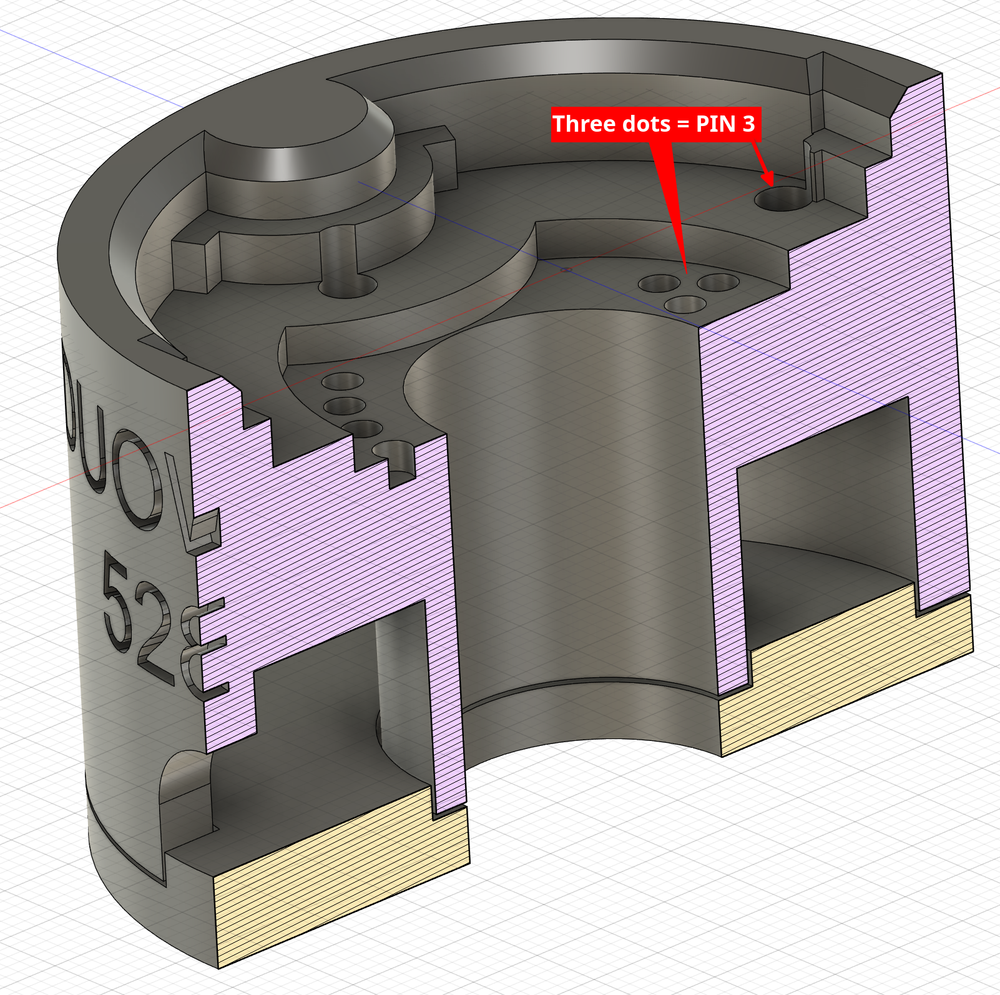

<!-- omit from toc -->
# Pogo Programmer for DUOWEISI 528332_LS2DH tags

> [!CAUTION]
> DUOWEISI makes _at least_ **two** different tags with a nrf52832 chip.
> They are _not_ interchangeable; the programming pad locations are different!
> This programmer is for the [variant that features the `LS2DH` accelerometer](https://www.aliexpress.us/item/3256805027170746.html)!

- [Files](#files)
- [Printing](#printing)
- [Assembly](#assembly)
  - [Pins](#pins)

## Files

The programmer is split into 3 parts:

- [`programmer-base.step`](./duoweisi-528332_programmer-base.step)

- [`bottom-cap.step`](./duoweisi-528332_programmer-bottom-cap.step)

- [`retention-sled.step`](./duoweisi-528332_programmer-retention-sled.step)

The `retention-sled` is optional; it is used to hold the tag in place for extended programming sessions.

I have arranged all the parts in a [single file](./duoweisi-528332_programmer.3mf) for ease of printing.

I have also included the [CAD model of the actual tag](./duoweisi-528332_LS2DH.step) that I used to design the programmer for reference. It's not a perfect model but it's close enough to be useful.

## Printing

Material choice and settings are not super critical.
You will want to use support material for the `base` part (green in the image above) but the other two parts should be fine without.

I used PLA with a .6mm nozzle and 0.2mm layer height.

Depending on how tuned your printer is, you may need to use a "reaming" device to clean up the holes for the pogo pins.
Any metal rod with a 1.0mm diameter should do nicely.

> [!TIP]
> Typically, the cheap "sim ejector" tools have a ~1.0mm diameter shaft.

## Assembly

> [!NOTE]
> I made a few small improvements to the `step` files after assembling the programmer pictured here. The initial version works fine but the newer version is a bit better.
> Just know that the photos are of a slightly older version of the design and the screenshots are of the latest version.

There's not much to it, really.

Remove the support material and clean up the holes with a reaming tool if needed.
Solder wires onto the pogo pins and insert them into the holes in the `base` part.

[These](https://www.amazon.com/gp/product/B08DCS2G3D/) are the pogo pins I used.

The jig is designed for these pins; the tips of the pins are touching the black surface that the base part is resting on and will just barely make contact with the cap when it is attached to the base.

> [!IMPORTANT]  
> If the link above ever dies, the pins are listed as `P50-J1/P50-B1/P75-B1/P75-E2/P100-E2 Pogo Pins`.
> Specifically, they have an OD of `0.68`mm and a non-compressed length of `16.0`mm.
>

Fill the base with hot glue and attach the `bottom-cap` part and let it cool and you should have a working programmer jig.
Keep it upside down while the glue cools to so the pogo pins are secured in the correct position.

### Pins

> [!IMPORTANT]
> The [Datasheet](../NRF52832%20LIS2DH.pdf) that I was given did not match the actual layout of the programming pads on the tag so I had to do some trial and error to figure out the correct layout.

| Pin # | Purpose |
| ----- | ------- |
| 1     | SWDIO   |
| 2     | SWCLK   |
| 3     | GND     |
| 4     | VCC     |

Where `Pin #` is indicated by the number of detents on the pogo pin holder:

