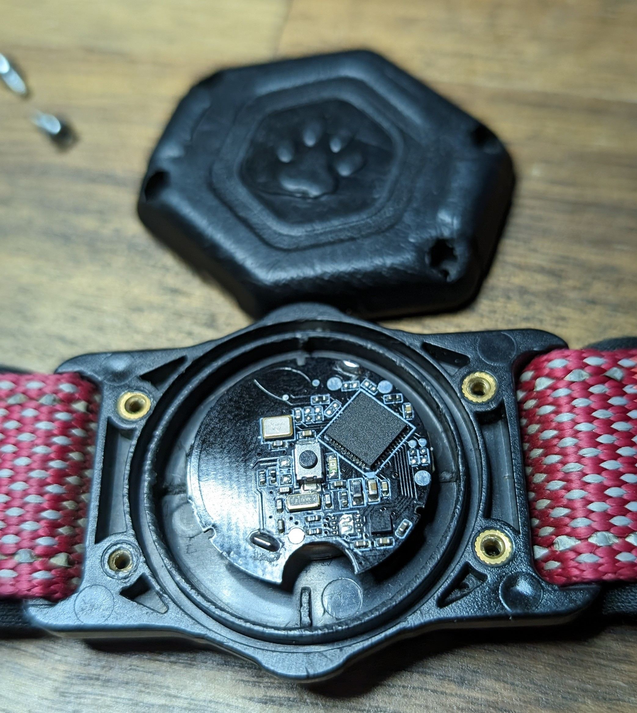
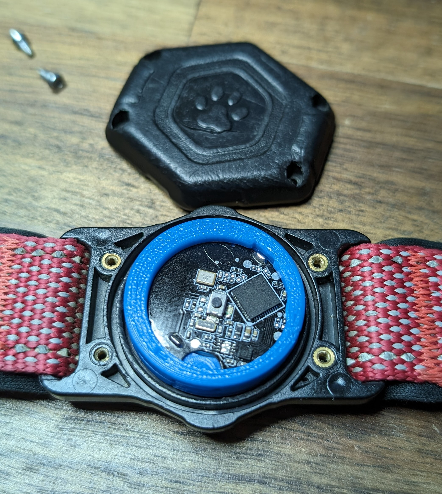

<!-- omit from toc -->
# Collar Adapter

Since the tags come as bare PCBs, the parts in this directory are simple 3d-printed parts to "fit" the tags into an "air-tag" like form factor instead of just rattling around inside the compartment

Without, the tags look like this:

And with:

> [!NOTE]
> Depending on the exact dimensions of your intended deployment location, you may need to adjust the parts somewhat.
