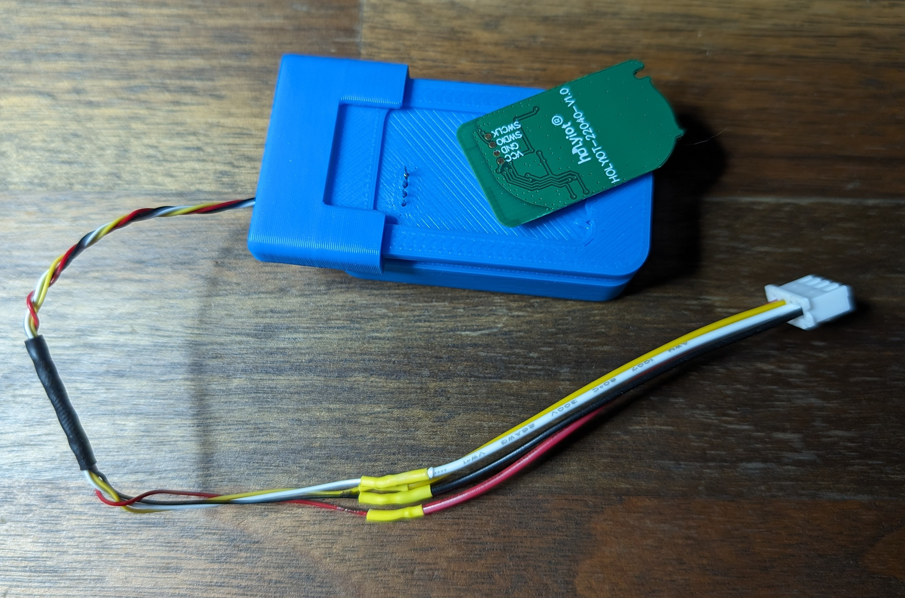

# HolyIoT 22040 Pogo Programmer

All of the same printing advice from the [DUOWEISI programmer](../../../DUOWEISI/programmmer/readme.md) applies here.

Print both [`dock`](dock.step) and [`sled`](sled.step) files and then insert the pogo pins and glue in place.

Use the sled to retain the tag while programming.

<!-- markdownlint-disable-file MD045-->

